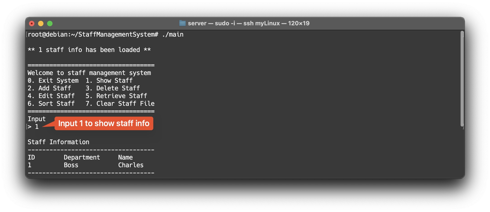

# Staff Management System using C++

A simple staff management system without UI.

## How to run

1. Clone: `git clone https://github.com/Avafly/StaffManagementSystem.git`
2. Compile: `g++ -I./include -o main src/*.cpp`
3. Run: `./main`

## Features

* Utilizes polymorphism for creating different staff objects including three types of staff: Employee, Manager, and Boss.
* Efficient memory allocation and release.
* Utilizes a CSV file to save and read staff data.
* Offers simple input validation.

## Demo

### Exit system

### Show staff

### Add staff

### Delete staff

### Edit staff

### Retrieve staff

### Sort staff

### Clear CSV file

